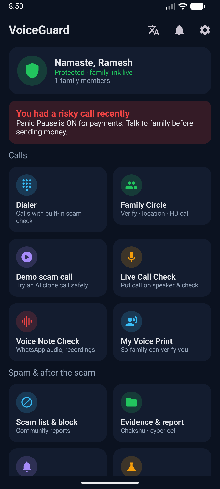
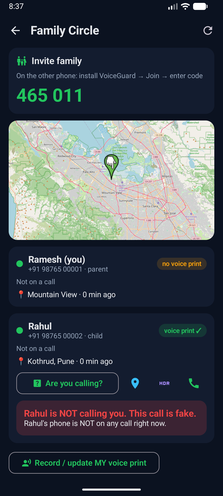
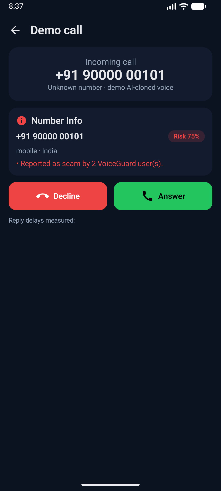
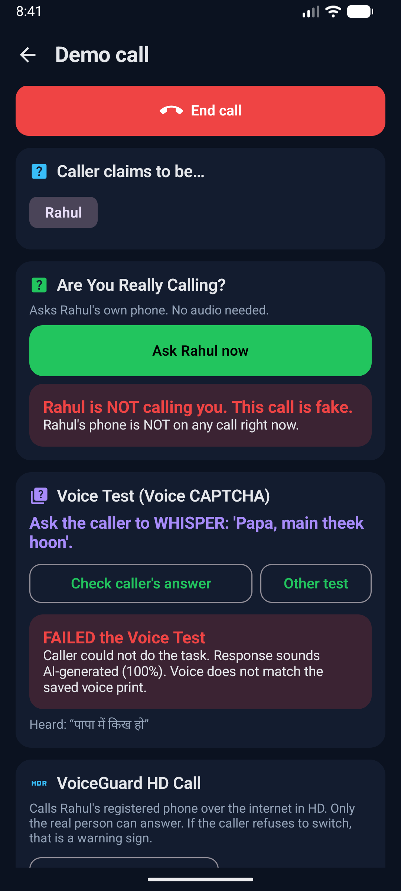
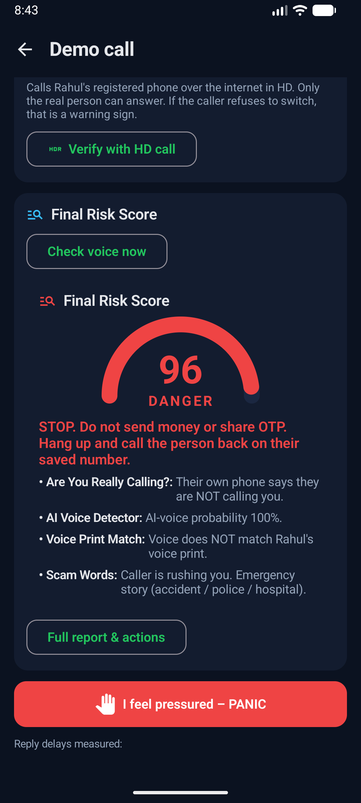
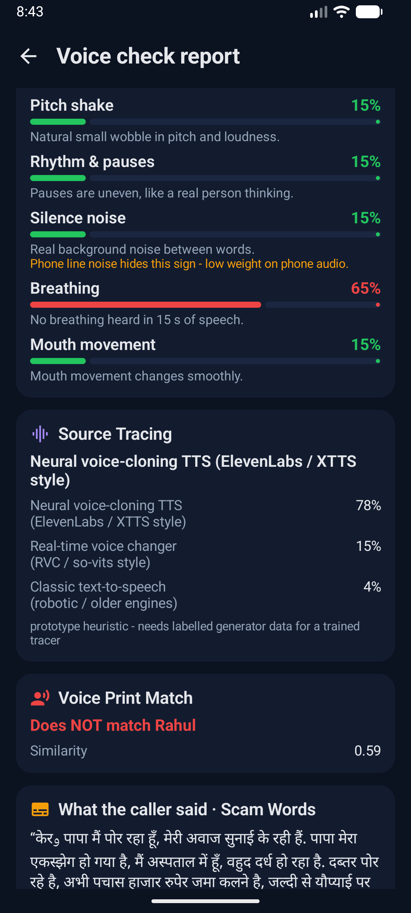
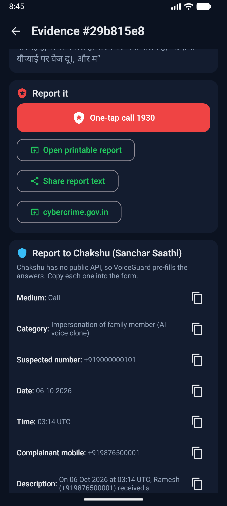
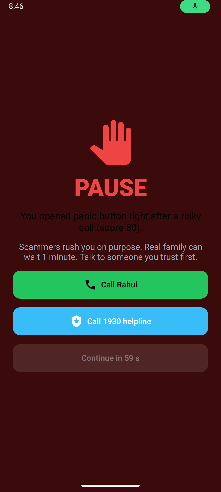

# VoiceGuard – prototype

Stops AI voice-clone scam calls ("Papa, I had an accident, send money"). Android app + AI server on a laptop.

```
 Android phones (Kotlin + Jetpack Compose)            Laptop (Python FastAPI)
 ┌───────────────────────────────┐   USB adb reverse  ┌───────────────────────────────────────┐
 │ Dialer · Call screening       │ ◄──── HTTP ──────► │ /api/analyze   voice checks + risk    │
 │ Family Circle · HD call audio │ ◄── WebSocket ───► │ /ws            family link, alerts    │
 │ Panic Pause · Evidence        │                    │ /ws/hd         HD call relay + live AI│
 └───────────────────────────────┘                    │ SQLite · models in K:\vgtools\hf      │
                                                      └───────────────────────────────────────┘
```

## Screenshots (real app, Android 17 emulator)

| Home | Are you really calling? | Scam call | Voice Test |
|---|---|---|---|
|  |  |  |  |

| Risk score | AI report | Evidence + Chakshu | Panic Pause |
|---|---|---|---|
|  |  |  |  |

## Tech stack

| Part | Tech |
|---|---|
| Android app | Kotlin 2.0, Jetpack Compose (Material 3), OkHttp (HTTP + WebSocket), kotlinx.serialization, osmdroid (OpenStreetMap), Android Telecom APIs (CallScreeningService, InCallService, RoleManager), AudioRecord/AudioTrack/MediaCodec |
| Server | Python 3.14, FastAPI, Uvicorn, WebSockets, SQLModel/SQLite |
| Audio | NumPy, SciPy, soxr, soundfile, Praat (parselmouth), librosa |
| AI | PyTorch 2.14 (CPU), Hugging Face Transformers |
| Build | JDK 17, Android SDK 35, Gradle 8.11, AGP 8.7 (all in `K:\vgtools`) |

## AI models

| Feature | Model / method |
|---|---|
| AI Voice Detector (3) | **VoiceGuard detector** – Microsoft WavLM-Base-Plus features + logistic head, *trained by us on phone-quality audio* (`backend/training/`) |
| Voice Print Match (10) | Microsoft `wavlm-base-plus-sv` x-vectors (cosine ≥ 0.86 = same speaker) |
| Scam Words (14), Voice Note text, Voice Test | OpenAI `whisper-small` (Hindi + English) + Hindi/Hinglish/English rule engine |
| Optional deeper scam-talk check | Claude (`claude-opus-5-5`) – only if `ANTHROPIC_API_KEY` is set in `backend/.env` |
| Reverse Engineering Engine (4) | Signal processing: jitter/shimmer/HNR, breathing, pause rhythm, silence noise floor, formant jumps |
| Source Tracing (5) | Rule-based mapping of fingerprints to generator families (*prototype heuristic*) |
| Reply Delay (13) | Turn-gap timing from voice activity (works at any audio quality) |
| Phone-quality training (#2) | 8 kHz, 300–3400 Hz, G.711 μ-law, AMR-like low bitrate, packet loss |
| Demo scam voices | Meta `mms-tts-hin` / `mms-tts-eng` (real neural TTS) |
| Smart Learning (31) | FedAvg federated learning simulation (NumPy) |

### Why we trained our own detector

`backend/scripts/eval_detectors.py` tested public Hugging Face deepfake detectors on human speech vs. AI speech
(AUC: 0.5 = coin toss, 1.0 = perfect):

| Detector | Clean AUC | Phone-quality AUC |
|---|---|---|
| MelodyMachine/Deepfake-audio-detection-V2 | 0.27 | 0.45 |
| mo-thecreator/Deepfake-audio-detection | 0.61 | 0.58 |
| garystafford/wav2vec2-deepfake-voice-detector | 0.65 | 0.61 |
| Our fingerprint rules | 0.97 | 0.43 |
| **VoiceGuard detector (trained on phone audio)** | see `backend/app/ai/weights/vg_detector_report.json` | |

Off-the-shelf detectors don't transfer, and phone lines destroy clean-audio clues – exactly pitch ideas #1 and #2.

## Run it

1. **Start the server** – double-click `start_server.bat` (first start loads models, ~30 s).
2. **Phones** – enable *Developer options → USB debugging* on both phones, plug them into the laptop, accept the prompt.
3. **Install** – double-click `install_app.bat` (installs the APK and links each phone to the server over USB).
   Re-run `connect_phones.bat` whenever you re-plug a phone.
4. **Set up** – on Papa's phone: name, number, role *Parent* → *Create family circle* → note the 6-digit code.
   On Rahul's phone: role *Son/Daughter* → *Join* with the code. Tap *Allow* on every permission row
   (Call screening, Usage access, Display over other apps, Full-screen alerts).
5. On Rahul's phone: *My Voice Print* → read 3 sentences.

Rebuild the app after code changes with `build_app.bat`.

**Only one phone (or the emulator)?** Run `sim_second_phone.bat` and type the family invite code – the laptop then
acts as "Rahul's phone" (online, not on a call, voice print saved, receives alerts).

**Improve the AI-voice detector:** `retrain_detector.bat` continues training with the extra Indian-language data
(Hindi, Marathi, Tamil, Telugu, Punjabi). It resumes where it stopped; restart the server afterwards.

## 3-minute demo script

1. **Papa** → *Demo scam call* → pretends to be **Rahul** → *Start*. The number already shows community scam reports (Number Info).
2. *Answer*. The cloned "Rahul" says he had an accident. Talk back – the app measures the reply delay.
3. Tap **Are You Really Calling?** → Rahul's phone is not on a call → **FAKE CALL** in red within a second,
   and Rahul's phone shows "Someone is pretending to be you to Papa".
4. **Voice Test** → "ask him to laugh" → *Check caller's answer* → the AI fails.
5. **Check voice now** → Final Risk Score (AI voice, voice print mismatch, scam words, reply delay) → DANGER.
6. *Full report* → **Save evidence** → *Evidence & report* → **Chakshu** pre-filled answers / **Call 1930** / **Ask family to report**.
7. Open Google Pay / PhonePe right after → **Panic Pause** screen.
8. **Verify with HD call** → Rahul accepts → real HD audio between the phones, live AI check of Rahul's real voice
   (voice print **match**, low risk).
9. *Future lab* → Bank API holds the ₹50,000 payment; police join; telecom flag; voice shield; federated learning.

## All 32 features → where they live

| # | Feature | Status | Where |
|---|---|---|---|
| 1 | VoiceGuard Dialer | Real (default phone app role) | `telecom/CallManager.kt`, `ui/InCallActivity.kt`, `ui/HomeScreens.kt` |
| 2 | Family Circle | Real | `routers/people.py`, `ui/FamilyScreens.kt` |
| 3 | AI Voice Detector | Real (trained model) | `ai/models.py`, `training/train_detector.py` |
| 4 | Reverse Engineering Engine | Real | `ai/fingerprints.py` |
| 5 | Source Tracing | Heuristic prototype | `ai/source_trace.py` |
| 6 | Live Call Check | Real on HD/demo calls; speaker-mode on normal calls* | `routers/hdcall.py`, `ui/CheckScreen.kt` |
| 7 | Voice Note Check | Real (share WhatsApp audio to app) | `audio/Decoder.kt`, `ui/CheckScreen.kt` |
| 8 | Are You Really Calling? | Real | `routers/verify.py`, `ui/CallTools.kt`, `ui/HdScreens.kt` |
| 9 | Family Location Check | Real (GPS + map) | `service/Loc.kt`, `ui/FamilyScreens.kt` |
| 10 | Voice Print Match | Real | `ai/models.py`, `ui/FamilyScreens.kt` |
| 11 | VoiceGuard HD Call | Real (16 kHz app-to-app) | `audio/HdAudio.kt`, `routers/hdcall.py` |
| 12 | Voice Test (Voice CAPTCHA) | Real | `ai/challenge.py`, `routers/checks.py` |
| 13 | Reply Delay Check | Real | `ai/reply_delay.py` |
| 14 | Scam Words Alert | Real (Whisper + rules, optional Claude) | `ai/scam_text.py` |
| 15 | Number Info | Real (prefix rules + community data) | `ai/number_info.py` |
| 16 | Final Risk Score | Real | `ai/risk.py` |
| 17 | Family Alert | Real (push over live link) | `routers/common.py`, `service/GuardService.kt` |
| 18 | Call-Back Alert | Real | `service/GuardService.kt (CallWatch)`, `routers/verify.py` |
| 19 | Panic Pause | Real (usage access + overlay) | `service/GuardService.kt`, `ui/PanicPauseActivity.kt` |
| 20 | Save Evidence | Real | `routers/evidence.py` |
| 21 | One-Tap Call 1930 | Real | everywhere (`dial()`) |
| 22 | Report to Chakshu | Pre-filled form + link (no public API) | `routers/evidence.py` |
| 23 | Family Calls Cyber Cell | Real | `routers/evidence.py` |
| 24 | Spam Warning | Real (call screening role) | `telecom/ScreeningService.kt` |
| 25 | Block Numbers | Real, shared by family | `telecom/ScreeningService.kt`, `routers/checks.py` |
| 26 | Community Scam List | Real | `routers/checks.py` |
| 27 | Auto Check Every Call | Partial (number on every call; voice on demo/HD) | Settings toggle |
| 28 | Police Join the Call | Simulated | `routers/future.py` |
| 29 | Telecom Partnership | Mock operator API | `routers/future.py` |
| 30 | Voice Shield | Prototype (audio watermark) | `ai/voice_shield.py` |
| 31 | Smart Learning (federated) | Simulation (FedAvg) | `app/training/federated.py` |
| 32 | Bank and Enterprise APIs | Real REST API (demo key) | `routers/future.py` |

\* Android 10+ does not let normal apps record phone-call audio. The app tries speaker-mode recording and tells
you if Android blocks it; HD calls, voice notes and the non-audio checks (#8, #9, #15, #19) cover that gap –
pitch idea #7.

## Folders

```
VoiceGuard/
  backend/           FastAPI server, AI engine, training scripts
    app/ai/          detector, fingerprints, voice print, ASR, scam words, risk fusion
    app/routers/     REST + WebSocket endpoints
    training/        phone_augment.py, build_dataset.py, train_detector.py, finetune_phone.py
    scripts/         make_demo_audio.py, eval_detectors.py, smoke_test.py
    demo_audio/      generated AI scam-call clips (HD + phone quality)
  android/           Android Studio / Gradle project
K:\vgtools\          JDK, Android SDK, Gradle, model cache, datasets (outside the project)
```
