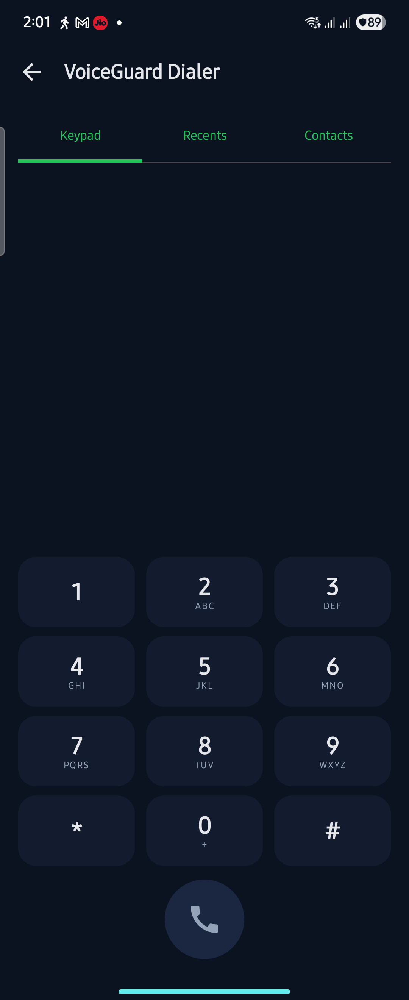

# VoiceGuard – prototype

Stops AI voice-clone scam calls ("Papa, I had an accident, send money"). Android app + AI server on a laptop.

```
 Android phone (Kotlin + Jetpack Compose)                  Laptop (Python 3.14 + FastAPI)
 ┌──────────────────────────────────────┐  USB adb reverse ┌──────────────────────────────────────────┐
 │ OTP sign-up → login token on every   │                  │ /api/auth     OTP sign-up, tokens        │
 │ request                              │                  │                                          │
 │ VoiceGuard Dialer (default Phone app)│                  │ /api/analyze  AI voice · fingerprints ·  │
 │  keypad · recents · contacts · SIMs  │ ◄──── HTTP ────► │               voice print · Whisper ·    │
 │ Call screen + live voice check       │                  │               scam words · risk score    │
 │ Caller ID card · spam/block screening│ ◄─ WebSocket ──► │ /ws           family link: "are you      │
 │ Family Circle · alerts · Panic Pause │                  │               calling?", alerts, location│
 │ HD call audio (16 kHz)               │ ◄─ WebSocket ──► │ /ws/hd        HD call relay + live AI    │
 │ Evidence · 1930 · Chakshu            │                  │ SQLite · models cached in K:\vgtools\hf  │
 └──────────────────────────────────────┘                  └──────────────────────────────────────────┘
        ▲  app closed? alerts, "are you calling?" and HD rings          │
        └──────────── Firebase Cloud Messaging (push) ◄─────────────────┘
        SMS code ◄── Twilio Verify ◄── /api/auth/otp/start (real SMS, read automatically by the app)
```

## Screenshots (real app, Android 17 emulator)

| Home | Are you really calling? | Scam call | Voice Test |
|---|---|---|---|
|  |  |  |  |

| Risk score | AI report | Evidence + Chakshu | Panic Pause |
|---|---|---|---|
|  |  |  |  |

| Dialer (Galaxy Z Flip3) |
|---|
|  |

## Tech stack

### Android app (`android/`)

| Area | Technology |
|---|---|
| Language & UI | Kotlin 2.0.21 · Jetpack Compose (BOM 2024.12.01, Material 3) · Navigation Compose 2.8.5 · Lifecycle 2.8.7 |
| Async & data | kotlinx.coroutines 1.9.0 · kotlinx.serialization-json 1.7.3 |
| Networking | OkHttp 4.12.0 – REST calls, the always-on WebSocket family link, and HD-call audio streaming |
| Phone calls (Telecom) | `RoleManager` (default Phone app + call-screening roles) · `InCallService` (own call screen, SIM picker, DTMF keypad, hold, mute, speaker) · `CallScreeningService` (spam warning, block list) · `TelecomManager.placeCall` with the chosen SIM (`PhoneAccountHandle`) |
| Phone data | `ContactsContract` (contacts + caller-ID lookup) · `CallLog` (Calls tab) · `TelephonyCallback` (call state for "Are you really calling?") · `Telephony.Sms` provider + `SMS_RECEIVED` receiver (Messages tab, scam-SMS and OTP-during-call warnings – read on the phone only) · `SmsManager` (replies, tell family) |
| Audio | `AudioRecord` / `AudioTrack` (16 kHz PCM, `VOICE_COMMUNICATION` + echo canceller) · `MediaExtractor` + `MediaCodec` (decodes WhatsApp Opus, m4a, mp3) · `MediaPlayer` (demo calls) |
| Notifications & overlays | Call notification with Answer / Decline / Hang up / Speaker / Mute actions · full-screen alerts · `WindowManager` overlay (Truecaller-style caller-ID card) |
| Push (app closed) | Firebase Cloud Messaging – `firebase-messaging` 25.1.3; Firebase is set up at run time from settings the server hands out, so the APK needs no `google-services.json` |
| OTP from SMS | Google Play services **SMS User Consent API** (`play-services-auth-api-phone` 18.1.0) – one tap on *Allow* fills in and checks the code, no SMS permission |
| Location & maps | `LocationManager` + `Geocoder` · osmdroid 6.1.20 (OpenStreetMap, no API key) |
| Background | Foreground service (`specialUse` + `location`) for the family link · `UsageStatsManager` (Panic Pause) · boot receiver |
| Build | Android Gradle Plugin 8.7.3 · Gradle 8.11.1 (wrapper) · JDK 17 (Temurin 17.0.20) · compileSdk/targetSdk 35 (Android 15) · minSdk 29 (Android 10) |
| Tested on | Samsung Galaxy Z Flip3 (SM-F711B, Android 15, dual SIM) · Android 17 emulator |

### Server (`backend/`)

| Area | Technology |
|---|---|
| Runtime | Python 3.14 |
| Web | FastAPI 0.142 · Uvicorn 0.54 (+ websockets 17.2) · Starlette 1.7 · Pydantic 2.13 · python-multipart · python-dotenv |
| Storage | SQLModel 0.0.47 on SQLAlchemy 2.0 + SQLite (users, family, alerts, evidence, scam list) |
| Sign-up & security | Phone-number OTP (Twilio Verify for real SMS, or demo mode) → login token; codes and tokens stored only as HMAC-SHA256 hashes; every route checks the token and that you act only for yourself / your family (httpx 0.28 for Twilio) |
| Push notifications | Firebase Cloud Messaging HTTP v1 API – service-account JWT signed with google-auth 2.60, sent with httpx; high-priority data messages |
| AI runtime | PyTorch 2.14.1 (CPU) · Hugging Face Transformers 5.18 · huggingface_hub 1.33 |
| Audio & DSP | NumPy 2.5 (FFT band-pass filters – no SciPy at runtime) · soundfile 0.14 / libsndfile 1.2.2 (WAV, FLAC, OGG-Opus, MP3 + real Opus/MP3 encoding) · soxr 1.1 (resampling) · Praat via parselmouth 0.4.7 |
| Optional LLM | Anthropic Python SDK 1.11 → `claude-opus-5-5` (only when `ANTHROPIC_API_KEY` is set) |
| Exact pins | `backend/requirements.txt` (server) · `backend/requirements-train.txt` (training extras) |

### Training & evaluation (`backend/training/`, `backend/scripts/`)

| Area | Technology |
|---|---|
| Classifier | Logistic regression on frozen WavLM features, fitted with PyTorch L-BFGS + a NumPy standard scaler (same maths as scikit-learn, but no SciPy – so Windows Smart App Control cannot block training) |
| Real speech | Google FLEURS (Hindi, English, Marathi, Tamil, Telugu, Punjabi) · LibriSpeech sample (read with pyarrow 25) |
| AI speech | Meta MMS-TTS (Hindi, English) · Microsoft SpeechT5 HiFi-GAN vocoder (re-synthesised real speech) · Windows SAPI voices |
| Channel augmentation | G.711 phone line, AMR-like low bitrate, packet loss, real Opus (WhatsApp) and phone+Opus |
| Federated learning demo | FedAvg simulation in NumPy |

### Developer tools

Git + GitHub (private repo) · GitHub CLI 2.102 · Android platform-tools (adb) · Windows `.bat` helpers
(`start_server`, `build_app`, `install_app`, `connect_phones`, `add_adb_to_path`, `retrain_detector`, `sim_second_phone`).

## AI models

| Feature | Model / method |
|---|---|
| AI Voice Detector (3) | **VoiceGuard detector** – frozen Microsoft WavLM-Base-Plus layers 2–6 (mean + std pooling) + logistic head, *trained by us on clean, phone-line and WhatsApp-Opus audio in Hindi, English, Marathi, Tamil, Telugu and Punjabi* (v3) (`backend/training/`, weights `app/ai/weights/vg_detector.npz`, 93 KB) |
| Voice Print Match (10) | Microsoft `wavlm-base-plus-sv` x-vectors (cosine ≥ 0.86 = same speaker); the detector reuses the same network, so no extra memory |
| Scam Words (14), Voice Note text, Voice Test | OpenAI `whisper-small` (Hindi + English) + Hindi/Hinglish/English rule engine (tolerant of Whisper's spelling) |
| Optional deeper scam-talk check | Claude (`claude-opus-5-5`) – only if `ANTHROPIC_API_KEY` is set in `backend/.env` |
| Reverse Engineering Engine (4) | Signal processing: jitter/shimmer/HNR, breathing, pause rhythm, silence noise floor, formant jumps (phone-aware weights) |
| Source Tracing (5) | Rule-based mapping of fingerprints to generator families (*prototype heuristic*) |
| Reply Delay (13) | Turn-gap timing from voice activity (works at any audio quality) |
| Phone-quality training (#2) | 8 kHz, 300–3400 Hz, G.711 μ-law, AMR-like low bitrate, packet loss, real Opus |
| Demo scam voices | Meta `mms-tts-hin` / `mms-tts-eng` (real neural TTS, CC-BY-NC – non-commercial) |
| Smart Learning (31) | FedAvg federated learning simulation (NumPy) |

Models download automatically on first run (~3 GB, cached in `K:\vgtools\hf` when that folder exists).

### Why we trained our own detector

`backend/scripts/eval_detectors.py` tested public Hugging Face deepfake detectors on human speech vs. AI speech
(AUC: 0.5 = coin toss, 1.0 = perfect):

| Detector | Clean AUC | Phone-line AUC | WhatsApp-Opus AUC |
|---|---|---|---|
| MelodyMachine/Deepfake-audio-detection-V2 | 0.27 | 0.45 | – |
| mo-thecreator/Deepfake-audio-detection | 0.61 | 0.58 | – |
| garystafford/wav2vec2-deepfake-voice-detector | 0.65 | 0.61 | – |
| Our fingerprint rules alone | 0.97 | 0.43 | – |
| **VoiceGuard detector v3** (held-out sentences/speakers) | **0.9996** | **0.998** | **0.999** |

VoiceGuard detector v3 accuracy on the held-out set: 99% clean, 98% phone line, 96% low-bitrate + packet loss,
99% WhatsApp Opus, 96% phone + Opus (2,551 clips; `app/ai/weights/vg_detector_report.json`). Real voices recognised
as real, per language: English 99%, Hindi 95%, Marathi 99%, Tamil 99%, Telugu 99%, Punjabi 97% (v2, which had no
Marathi/Tamil/Telugu/Punjabi training data: Punjabi 83%). It still catches all 66 unseen AI test clips (demo voices,
SAPI) on clean, phone-line and WhatsApp audio. Known gap: one Spanish clip and one old Hindi recording are still
scored as AI (lower than v2) – the final risk score also needs other signals before it says DANGER.
Previous model: `vg_detector_v2_backup.npz`.

Off-the-shelf detectors don't transfer, and phone lines destroy clean-audio clues – exactly pitch ideas #1 and #2.

## Run it

**First time on a new PC** (needs Python 3.14, JDK 17 and the Android SDK – or Android Studio):
```powershell
cd backend
python -m venv .venv
.venv\Scripts\pip install -r requirements.txt
```
Then build the APK with `build_app.bat` (or open `android/` in Android Studio and press Run).

1. **Start the server** – double-click `start_server.bat` (first start downloads/loads models, ~30 s after the first time).
2. **Phones** – enable *Developer options → USB debugging* on both phones, plug them into the laptop, accept the prompt.
3. **Install** – double-click `install_app.bat` (installs the APK and links each phone to the server over USB).
   Re-run `connect_phones.bat` whenever you re-plug a phone.
4. **Set up** – on Papa's phone: name, number, role *Parent* → **Send OTP** → type the 6-digit code →
   *Create family circle*. Then **Family → Add family member** → pick Rahul from contacts (or type his number) →
   send him the invite by SMS / WhatsApp.
   On Rahul's phone: sign in with *his* number → the invitation appears → **Join** (or join with the 6-digit code). Tap *Allow* on every permission row
   (Call screening, Usage access, Display over other apps, Full-screen alerts).
5. On Rahul's phone: *My Voice Print* → read 3 sentences.

Rebuild the app after code changes with `build_app.bat`.

**Only one phone (or the emulator)?** Run `sim_second_phone.bat` and type the family invite code – the laptop then
acts as "Rahul's phone" (online, not on a call, voice print saved, receives alerts).

**Improve the AI-voice detector:** `retrain_detector.bat` continues training with the extra Indian-language data
(Hindi, Marathi, Tamil, Telugu, Punjabi). Feature extraction pauses by itself after 100 minutes and resumes where it
stopped when you run it again. The result is saved as `app/ai/weights/vg_detector_candidate.npz` with a report per
language; copy it over `vg_detector.npz` only if the report is better, then restart the server.

## Sign-up and security (OTP)

Every account is created by **verifying the phone number with a one-time code**; there is no other way in.

1. App → `POST /api/auth/otp/start {phone}` – the server sends a 6-digit code.
2. App → `POST /api/auth/otp/verify {phone, code, name, role}` – right code → account created (or the existing one
   for that number) + a **login token**. The app stores it and sends `Authorization: Bearer <token>` on every request;
   WebSockets and browser links (printable evidence report) use `?token=`.
3. Without a valid token the server answers **401**; acting for another user answers **403**; family data, evidence
   and voice prints are visible only inside your family circle. `POST /api/auth/logout` revokes the token.

| Rule | Value |
|---|---|
| Code length / lifetime | 6 digits, 5 minutes, single use |
| Wrong guesses | 5 per code, then ask for a new code |
| Resend | after 30 s, at most 5 codes per number per hour |
| Login token | 180 days, random 256-bit, stored only as an HMAC-SHA256 hash (`data/secret.key`) |

**How the code is delivered** (set in `backend/.env`, see `.env.example`):
- **Demo mode** (default): no SMS – the code is printed in the server window and `backend\data\dev_otp.log`.
- **Real SMS**: fill `TWILIO_ACCOUNT_SID`, `TWILIO_AUTH_TOKEN`, `TWILIO_VERIFY_SID` (Twilio Verify). A Twilio **trial**
  can only text numbers listed under *Phone Numbers → Verified Caller IDs* in the Twilio console – add each family
  phone there first. The app reads the code from the SMS: Android asks *"Allow VoiceGuard to read this message?"*,
  one tap on **Allow** fills in the code and signs in (SMS User Consent API – the app never gets SMS permission and
  sees only that one message).
- **Test numbers**: `VG_OTP_TEST_NUMBERS=+919876500002:246810` – fixed codes, no SMS (for judges / `sim_second_phone.bat`).

Partner APIs (bank `/api/v1/enterprise/*`, telecom `/api/v1/telecom/flag`) use their own API keys instead.

## Opening the app: a phone app with VoiceGuard built in

VoiceGuard opens like a normal dialer (Truecaller-style), with five tabs:

| Tab | What it shows |
|---|---|
| **Calls** | Search bar with ⋮ menu (starred / outgoing / incoming / missed / blocked calls, settings), protection status card, *Frequently called*, call history with direction, time, contact names, *Scam* / *Blocked* tags, the blue dial-pad button |
| **Messages** | The phone's SMS, grouped by sender, with *All · People · Suspicious* filters and unread counts. Each message is checked **on the phone** (nothing uploaded): KYC/account-block threats, links, prize/job bait, "bank" texts from personal numbers, requests to share an OTP, reported numbers. Open a conversation to see the warning under each risky message, how often that number called you, reply by SMS, call or report it |
| **Contacts** | Family first, then the phone's contacts |
| **Family** | Family Circle (verify, location, HD call) |
| **Protect** | The three protection layers and all VoiceGuard tools |

**Messages from the caller.** If the person you are talking to sends you an SMS, it appears on the call screen. If
**any code / OTP arrives during a call**, VoiceGuard shows a red card and an urgent notification: *"NEVER share this
OTP with the caller"* – the classic "read me the code I just sent" scam. A scam SMS outside a call gives a
*"⚠ Scam SMS"* notification. VoiceGuard does not replace your SMS app; it only reads (needs the SMS permission).

## Three protection layers

The home screen groups the features by *when* they help:

| Layer | When | Features |
|---|---|---|
| 1 · Spam protection | before you answer | Spam warning + caller-ID card, community scam list, block list, Number Info, Voice Note Check |
| 2 · During the call | while you are talking | **AI live check** (top of the call screen), **Tell family – without hanging up** (app alert · SMS · WhatsApp), Are you really calling?, HD call, Voice Test, Panic button / Panic Pause |
| 3 · After the scam | after hanging up | Call-Back Alert, evidence, 1930, Chakshu, family calls cyber cell, family alerts |

**AI live check on a normal call.** VoiceGuard puts the call on speaker and checks the caller every 6 seconds
(AI voice, voice fingerprints, voice print; scam words every 3rd check). Two things make this work on a real phone:
- *Your own voice is removed first.* The microphone hears both people; 1.5-second pieces that match **your** saved
  voice print (*My Voice Print*) are cut out on the server (`ai/separate.py`), so a real human (you) cannot hide an AI
  caller. Save your own voice print once for this.
- *Android mutes the microphone for apps during a call.* Accessibility apps are the exception, so turn on
  **Settings → Accessibility → Installed apps → VoiceGuard call listening** once. It reads no screen content.
  If the check still hears silence, the card says so – then use *Are you really calling?* / HD call, which need no
  call audio. (If Android shows "Restricted setting": *App info → ⋮ → Allow restricted settings*.)

**The call screen** looks like a normal phone's: caller on top, round buttons, red End. Row 1 *Mute · Speaker ·
Hold*, row 2 *AI check · Family · Keypad*, row 3 *Voice test · Panic · More*. The AI result appears as a coloured
pill under the caller's name ("AI risk 87 · likely AI / scam"); *Family* puts **Are you really calling?** and
**Tell family** together in one panel.

**One tap, nothing else opens.** *Alert everyone now* sends the VoiceGuard app alert, an **SMS from your own SIM**
and a **WhatsApp message sent by the server** at once (3 seconds to cancel a mistaken tap). WhatsApp does not let an
app send from *your* WhatsApp without opening it, so the server sends from a WhatsApp business number through
Twilio (`TWILIO_WHATSAPP_FROM`, `app/messaging.py`). For testing it is the Twilio WhatsApp Sandbox
(+1 415 523 8886): each family phone sends `join <your code>` to it once (code in Twilio console → Messaging →
Try it out → Send a WhatsApp message); alerts then reach them for 24 h after their last message to that number and
the sandbox membership lasts 3 days. Production: your own WhatsApp sender + an approved template
(`TWILIO_WHATSAPP_CONTENT_SID`). If WhatsApp can't be delivered, the panel offers *Open WhatsApp instead*.

**Tell family during a call.** Three buttons in the *Family* panel: *App alert* (push to every family phone),
*SMS* (sent straight from your phone on the call's SIM – works even if they have no internet; shows you the text
first) and *WhatsApp* (opens their chat with the message typed in – WhatsApp only lets you press Send yourself).
The message contains the caller's number, who they claim to be, the AI risk score and a map link to where you are.

## Alerts when the app is closed (push notifications)

The live WebSocket link is the fast path. **Alerts, "Are you really calling?" questions and HD call rings are also
sent through Firebase Cloud Messaging (FCM)** as high-priority data messages, so they reach a phone whose app was
swiped away or killed by the battery saver. The app shows each one once, whichever copy arrives first; answers from
the notification buttons go back over HTTPS (`/api/verify/answer`, `/api/hd/answer`), so they work before the live
link reconnects. A family member counts as reachable for "Are you really calling?" and HD calls if they are online
**or** have a push token.

Set-up (once, free Firebase "Spark" plan):
1. [console.firebase.google.com](https://console.firebase.google.com) → *Add project*.
2. *Add app → Android*, package name `com.voiceguard.app` → download **google-services.json** →
   save it as `backend\data\google-services.json` (the app does not need it – the server hands the public values to
   the phone after sign-in, so no rebuild).
3. *Project settings → Service accounts → Generate new private key* → save it as
   `backend\data\firebase-service-account.json`. This is a secret server key: keep it only on the laptop
   (`backend/data/` is git-ignored).
4. Restart the server; `/api/health` shows `"push": "on"`. On the phone: *Settings → Alerts when the app is closed →
   Check & send test push*.

Samsung phones: also set *Settings → Battery → Background usage limits → Never sleeping apps → VoiceGuard*, or
One UI may hold pushes for "sleeping" apps.

## Troubleshooting

**`adb : The term 'adb' is not recognized…`** – Windows doesn't know where `adb.exe` is.
- The `.bat` scripts don't need it on PATH: they search PATH, `ANDROID_HOME`, `ANDROID_SDK_ROOT`,
  Android Studio's `%LOCALAPPDATA%\Android\Sdk` and `K:\vgtools\android-sdk` (`tools\find_adb.bat`).
- To type `adb` yourself, double-click `add_adb_to_path.bat`, then **open a new terminal** (terminals only read
  PATH when they start; restart VS Code / the Claude app if the terminal lives inside it).
- Quick fix for the terminal you already have open (PowerShell):
  `$env:Path += ";K:\vgtools\android-sdk\platform-tools"`

**AI check says nothing / "AI is still starting"** – after `start_server.bat` the AI models need about 10–30 s to
load (the window prints `AI models ready`). Once the models are downloaded the server loads them from
`K:\vgtools\hf` without going online – on a slow connection the online check used to take minutes. Set
`VG_HF_ONLINE=1` to force a fresh check for model updates.

**Phone not listed by `adb devices`** – enable *Developer options → USB debugging*, use a data USB cable, and tap
*Allow* on the phone. Some brands need their USB driver (Samsung: "Samsung Android USB Driver").

## 3-minute demo script

1. **Papa** → *Demo scam call* → pretends to be **Rahul** → *Start*. The number already shows community scam reports (Number Info).
2. *Answer*. The cloned "Rahul" says he had an accident. Talk back – the app measures the reply delay.
3. Tap **Are You Really Calling?** → Rahul's phone is not on a call → **FAKE CALL** in red within a second,
   and Rahul's phone shows "Someone is pretending to be you to Papa".
4. **Voice Test** → "ask him to laugh" → *Check caller's answer* → the AI fails.
5. **Check voice now** → Final Risk Score (AI voice, voice print mismatch, scam words, reply delay) → DANGER.
6. *Full report* → **Save evidence** → *Evidence & report* → **Chakshu** pre-filled answers / **Call 1930** / **Ask family to report**.
7. Open Google Pay / PhonePe right after → **Panic Pause** screen.
8. **Verify with HD call** → Rahul accepts → real HD audio between the phones, live AI check of Rahul's real voice
   (voice print **match**, low risk).
9. *Future lab* → Bank API holds the ₹50,000 payment; police join; telecom flag; voice shield; federated learning.

## All 32 features → where they live

| # | Feature | Status | Where |
|---|---|---|---|
| 1 | VoiceGuard Dialer | Real: default Phone app – keypad (T9 search), real call log, phone contacts, caller ID card, in-call keypad/hold/mute/speaker | `ui/DialerScreen.kt`, `data/Contacts.kt`, `ui/InCallActivity.kt`, `telecom/CallerIdOverlay.kt` |
| 2 | Family Circle | Real: add members by phone number (they confirm with Join on their own verified number), or family code | `routers/people.py`, `ui/FamilyScreens.kt`, `ui/FamilyAdd.kt` |
| 3 | AI Voice Detector | Real (trained model) | `ai/models.py`, `training/train_detector.py` |
| 4 | Reverse Engineering Engine | Real | `ai/fingerprints.py` |
| 5 | Source Tracing | Heuristic prototype | `ai/source_trace.py` |
| 6 | Live Call Check | Real time, at the top of the call screen: HD/demo calls fully; normal calls via loudspeaker every 6 s (auto for unknown callers), your own voice cut out by voice print, mic unblocked by "VoiceGuard call listening"* | `ui/LiveCall.kt`, `ai/separate.py`, `service/CallListenService.kt` |
| 7 | Voice Note Check | Real (share WhatsApp audio to app) | `audio/Decoder.kt`, `ui/CheckScreen.kt` |
| 8 | Are You Really Calling? | Real | `routers/verify.py`, `ui/CallTools.kt`, `ui/HdScreens.kt` |
| 9 | Family Location Check | Real (GPS + map): Family tab map, "Where is … now?" with a live fix on the call screen, the sender's place + Map button on every family alert, and a fresh map link in SMS / WhatsApp alerts | `service/Loc.kt`, `ui/FamilyScreens.kt`, `ui/CallTools.kt`, `routers/common.py` |
| 10 | Voice Print Match | Real | `ai/models.py`, `ui/FamilyScreens.kt` |
| 11 | VoiceGuard HD Call | Real (16 kHz app-to-app) | `audio/HdAudio.kt`, `routers/hdcall.py` |
| 12 | Voice Test (Voice CAPTCHA) | Real | `ai/challenge.py`, `routers/checks.py` |
| 13 | Reply Delay Check | Real | `ai/reply_delay.py` |
| 14 | Scam Words Alert | Real (Whisper + rules, optional Claude) | `ai/scam_text.py` |
| 15 | Number Info | Real (prefix rules + community data) | `ai/number_info.py` |
| 16 | Final Risk Score | Real | `ai/risk.py` |
| 17 | Family Alert | Automatic: DANGER result, reported/high-risk caller, fake "Are you calling?", Panic – with a Call button. During a call one tap also sends it by **SMS** or **WhatsApp** without hanging up | `routers/common.py`, `service/Inbox.kt`, `ui/TellFamily.kt` |
| 18 | Call-Back Alert | Real | `service/GuardService.kt (CallWatch)`, `routers/verify.py` |
| 19 | Panic Pause | Real (usage access + overlay) | `service/GuardService.kt`, `ui/PanicPauseActivity.kt` |
| 20 | Save Evidence | Real | `routers/evidence.py` |
| 21 | One-Tap Call 1930 | Real | everywhere (`dial()`) |
| 22 | Report to Chakshu | Pre-filled form + link (no public API) | `routers/evidence.py` |
| 23 | Family Calls Cyber Cell | Real | `routers/evidence.py` |
| 24 | Spam Warning | Real (call screening role) | `telecom/ScreeningService.kt` |
| 25 | Block Numbers | Real, shared by family | `telecom/ScreeningService.kt`, `routers/checks.py` |
| 26 | Community Scam List | Real | `routers/checks.py` |
| 27 | Auto Check Every Call | Partial (number on every call; voice on demo/HD) | Settings toggle |
| 28 | Police Join the Call | Simulated | `routers/future.py` |
| 29 | Telecom Partnership | Mock operator API | `routers/future.py` |
| 30 | Voice Shield | Prototype (audio watermark) | `ai/voice_shield.py` |
| 31 | Smart Learning (federated) | Simulation (FedAvg) | `app/training/federated.py` |
| 32 | Bank and Enterprise APIs | Real REST API (demo key) | `routers/future.py` |

\* Android 10+ does not let normal apps record phone-call audio. The app tries speaker-mode recording and tells
you if Android blocks it; HD calls, voice notes and the non-audio checks (#8, #9, #15, #19) cover that gap –
pitch idea #7.

## Folders

```
VoiceGuard/
  backend/           FastAPI server, AI engine, training scripts
    app/ai/          detector, fingerprints, voice print, ASR, scam words, risk fusion
    app/routers/     REST + WebSocket endpoints
    training/        phone_augment.py, build_dataset.py, train_detector.py, finetune_phone.py
    scripts/         make_demo_audio.py, eval_detectors.py, smoke_test.py
    demo_audio/      generated AI scam-call clips (HD + phone quality)
  android/           Android Studio / Gradle project
K:\vgtools\          JDK, Android SDK, Gradle, model cache, datasets (outside the project)
```
